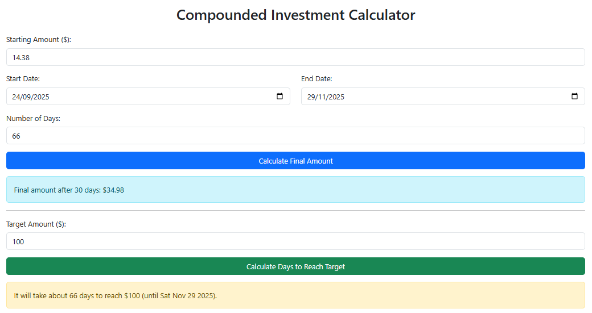

# 📈 Compounded Investment & Withdrawal Calculator

A simple web app that calculates:

- **Final balance** after compounding and optional withdrawals  
- **Days needed** to reach a target amount  
- Visual **bar graph** to track withdrawals and remaining balance  

It compounds at **1% increase 3 times per day** and rounds each increase to the nearest tenth — just like the original Python logic.

Users can enter a start amount, add withdrawals, pick start & end dates, or input the number of days. The app automatically keeps the days and end date in sync.

---

## 🚀 Features

✅ Calculate the **final amount** after daily compounding  
✅ Calculate the **days needed** to reach a target amount  
✅ **Withdrawal tracking** — subtracts amounts and updates balance  
✅ **Bar graph** showing withdrawn (red) vs remaining (blue/light-blue) balance  
✅ Month-end checkpoint bars in **light blue** if no withdrawals exist in that month  
✅ Pick **start & end dates** with automatic day calculation  
✅ Enter a **number of days** and automatically update the end date  
✅ Uses **Bootstrap 5** for a clean, responsive UI  
✅ Works entirely in the browser — no server needed  

---

## 🧮 How the Calculation Works

- **Starting balance for new users:** $300 free trial  
- **After 3 days:** The $300 trial is withdrawn automatically.  
- Your **new starting balance** after compounding for 3 days is about **$28.10**.  
- **Compounding:** 3 times per day at **1% per period**.  
- **Rounding:** Each increase is rounded to the nearest tenth before adding.  
- **Withdrawal logic:** You can subtract funds at any time; the bar graph updates to show withdrawn vs remaining balance.  
- **Month-end checkpoint:** A light-blue bar shows the balance at the last day of each month **only if no withdrawals occur that month**.  

Example for one compounding cycle:  
increase = current_amount × 0.01
rounded_increase = round(increase to nearest 0.1)  
new_amount = current_amount + rounded_increase  

---

## ⚡ Getting Started

1. **Open** [https://supercoolfire.github.io/compounding1/](https://supercoolfire.github.io/compounding1/)

---

## 🧪 Usage

1. Enter your **Starting Amount** (defaults to $300 for new users).  
2. Choose **Start Date** (defaults to today).  
3. Either:
   - Enter the **Number of Days** → End date updates automatically.  
   - Pick an **End Date** → Number of days updates automatically.  
4. Add any **Withdrawals** to simulate cashing out.  
5. Click **Calculate Final Amount** to see your investment growth and updated bar graph.  
6. Or enter a **Target Amount** and click **Calculate Days to Reach Target**.  

---

## 📊 Bar Graph

- **Red bar (top):** Total withdrawn  
- **Blue bar (bottom):** Remaining balance after withdrawals  
- **Light-blue bar:** Month-end balance if no withdrawal exists in that month  
- **Width:** Each bar is fixed at **1rem** for clean, easy-to-read display  

---

## 🖼️ Screenshot

---

## 📜 License

MIT License — feel free to use and modify.

---

## 👨‍💻 Author

Created by **Jayser Pilapil**.
